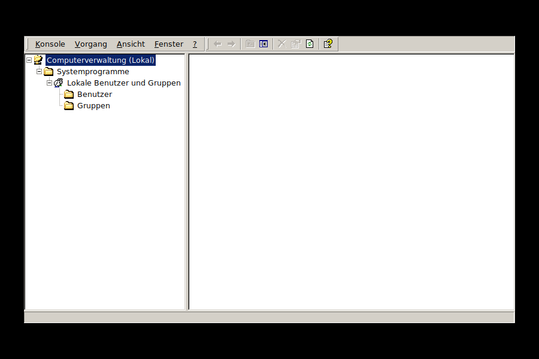
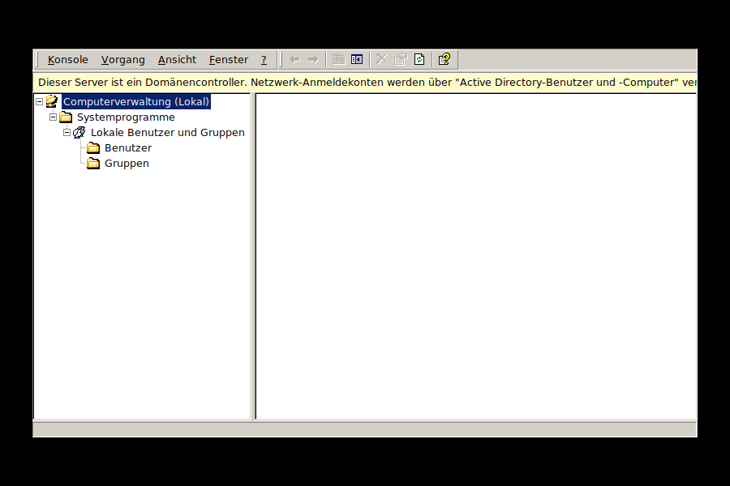

# compmgmt -- Computerverwaltung für ice2k

Ein Nachbau des Windows-2000-"Computerverwaltung"-Snapins (MMC) für
[ice2k](https://github.com/comdlg32/ice2k), Zweige **"Lokale Benutzer
und Gruppen"** und **"Freigegebene Ordner"**.
Gebaut mit demselben FOX-Toolkit-Muster wie `dnsmgr`/`dhcpmgr`.
Backend: **echte Linux-Benutzer/-Gruppen**, parallel dazu **Samba**
(`smbpasswd`/`pdbedit`) synchron gehalten.



## Warum Linux-User *und* Samba zusammen?

Samba kann keinen eigenständigen Benutzer ohne zugrundeliegenden
Unix-Account verwalten -- ein Samba-Konto ist technisch immer eine
Ergänzung zu einem echten Linux-User (Samba speichert zusätzlich nur
den NT-Passwort-Hash, den SMB für die Authentifizierung braucht und
der sich nicht aus dem Unix-`crypt()`-Hash berechnen lässt). Damit ein
Konto sich wie ein lokales Windows-2000-SAM-Konto verhält (eine
Anmeldung, gültig für Konsole **und** Netzwerkfreigaben), legt
`compmgmt` bei jeder Aktion **beides** synchron an:
- Linux-Seite: `useradd`/`usermod`/`userdel`/`groupadd`/`groupdel`/`gpasswd`
- Samba-Seite: `chpasswd` + `smbpasswd`/`pdbedit`

## Funktionsumfang
- Fenster/Menü/Toolbar im MMC-Look, mit denselben Original-Icons wie
  `dnsmgr`/`dhcpmgr`
- Baumansicht wie im Original: Computerverwaltung (Lokal) ->
  Systemprogramme -> Lokale Benutzer und Gruppen -> **Benutzer** /
  **Gruppen** sowie Systemprogramme -> Freigegebene Ordner ->
  **Freigaben** / **Sitzungen** / **Geöffnete Dateien**
- Root-Rechte beim Start über `i2ksudo` (identisches Muster wie
  `dnsmgr`/`dhcpmgr`)
- Benutzerliste zeigt **alle** Linux-Konten (auch Systemkonten wie
  `root`/`www-data`), mit erkanntem "(deaktiviert)"-Status aus
  `/etc/shadow`
- **Neuer Benutzer...**: Benutzername, Vollständiger Name,
  Beschreibung (beide im GECOS-Feld von `/etc/passwd`), Kennwort,
  Kennwort bestätigen, "Konto ist deaktiviert" -- "Hinzufügen"/
  "Schließen"-Muster wie im Original
- **Eigenschaften**: Vollständiger Name/Beschreibung/Deaktiviert
  editierbar (Benutzername bewusst read-only -- ein Unix-Account
  umzubenennen ist wegen Home-Verzeichnis/Dateibesitz heikel)
- **Kennwort festlegen...** als eigener Menüpunkt (wie im Original,
  nicht Teil der Eigenschaften). Setzt Unix- **und**
  Samba-Passwort synchron, ohne einen vorherigen Deaktiviert-Status
  zu verlieren.
- **Löschen** (`userdel -r` + `smbpasswd -x`)
- Gruppen: **Neue Gruppe...**, **Eigenschaften** mit Mitgliederliste
  (Hinzufügen/Entfernen, per `gpasswd -M` gespeichert), **Löschen**

## Freigegebene Ordner

Der zweite Zweig bildet "Freigegebene Ordner" nach. Backend sind
direkt die Freigabe-Abschnitte der `/etc/samba/smb.conf` sowie
`smbstatus` für die Laufzeitdaten.

- **Freigaben**: Liste mit Freigabename/Ordnerpfad/Beschreibung.
  "Neue Freigabe..." (Ordner auswählen, Name, Beschreibung,
  Schreibschutz) hängt einen neuen Abschnitt an die `smb.conf` an --
  der Dialog bleibt nach dem Anlegen offen, damit sich mehrere
  Freigaben hintereinander erstellen lassen. "Eigenschaften" bearbeitet
  Pfad/Beschreibung/Schreibschutz durch gezieltes Ersetzen der
  betroffenen Zeilen; "Freigabe aufheben" entfernt den Abschnitt
  wieder. Der Freigabename selbst bleibt fest -- wie im Original muss
  man dafür aufheben und neu anlegen.
- Die technischen Abschnitte `[global]`, `[homes]`, `[printers]`,
  `[print$]`, `[sysvol]` und `[netlogon]` werden ausgeblendet, analog
  dazu, dass das Original administrative Freigaben wie `C$`
  standardmäßig nicht anzeigt.
- **Sitzungen** (Benutzer/Computer/Freigaben/Protokoll) und
  **Geöffnete Dateien** (Datei/Benutzer/Freigabe) kommen live aus
  `smbstatus --json`, das über ein kurzes Python-Skript nach TSV
  umgesetzt wird -- robuster als eigenes JSON-Parsing in C++ für eine
  reine Anzeigefunktion.

## Bauen
```sh
cd compmgmt
make
./compmgmt
```
Voraussetzung: `samba`/`samba-common-bin` installiert (für
`smbpasswd`/`pdbedit`).

## Verhalten auf einem Domänencontroller



Anders als bei Windows verschwinden bei uns die lokalen Linux-Konten
**nicht**, wenn der Server per `dcpromo` zum Domänencontroller wird --
`samba-tool domain provision` ersetzt nur Sambas eigene Passwort-
Datenbank, nicht die Unix-Konten selbst (`/etc/passwd` bleibt
unangetastet). Diese Konten werden weiterhin für SSH/`sudo`/
Systemdienste benötigt.

Deshalb sperrt `compmgmt` auf einem Domänencontroller **nicht** wie im
Original, sondern deutet um: ein gelber Hinweis-Banner erklärt, dass
Netzwerk-Anmeldekonten jetzt über
[`dsadmin`](../dsadmin/README.md) verwaltet werden, und alle
`smbpasswd`-Aufrufe (Anlegen/Kennwort/Aktivieren/Deaktivieren/
Löschen) werden übersprungen -- die reine Linux-Kontoverwaltung
(`useradd`/`usermod`/`userdel`/`chpasswd`) läuft unverändert weiter.

## Bekannte Grenzen / mögliche nächste Schritte
- Bei Freigaben: keine Berechtigungsverwaltung (Freigabe- und
  NTFS-Berechtigungen), kein Trennen einzelner Sitzungen und kein
  Schließen einzelner geöffneter Dateien -- Sitzungen und geöffnete
  Dateien sind reine Anzeige.
- Weitere Zweige der Computerverwaltung (Ereignisanzeige,
  Systemleistungsprotokolle, Geräte-Manager, Datenträgerverwaltung,
  Dienste und Anwendungen) fehlen noch.
- Kein "Benutzer muss Kennwort bei der nächsten Anmeldung ändern" /
  "Kennwort läuft nie ab" (chage-basierte Flags) -- nur "Konto ist
  deaktiviert" wird abgebildet.
- Benutzername lässt sich nicht nachträglich ändern (bewusst, siehe
  oben).
- Keine Prüfung, ob eine Gruppe noch die primäre Gruppe eines
  Benutzers ist, bevor sie gelöscht wird (schlägt dann einfach mit
  Fehlermeldung von `groupdel` fehl).
- Kein Sync über PAM (`pam_smbpass`) -- ändert ein Benutzer sein
  Passwort außerhalb von `compmgmt` (z.B. per `passwd`), läuft der
  Samba-Hash auseinander, bis er hier erneut gesetzt wird.
