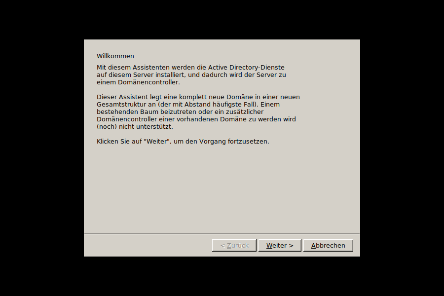

# dcpromo -- Assistent zum Installieren von Active Directory für ice2k

Ein Nachbau des Windows-2000-`dcpromo`-Assistenten für
[ice2k](https://github.com/comdlg32/ice2k). Gebaut mit demselben
FOX-Toolkit-Muster wie `dnsmgr`/`dhcpmgr`/`compmgmt`. Backend: **Samba
als AD-Domain-Controller** (`samba-tool domain provision`).



## Umfang -- bewusst nur der häufigste Fall

Dieser Assistent bildet **nur** "Domänencontroller für eine neue
Domäne" + "Neue Domänenstruktur erstellen" + "Neue Gesamtstruktur aus
Domänenstrukturen erstellen" ab -- die mit Abstand häufigste
Kombination beim Original. Bewusst (noch) nicht unterstützt, aber
**nicht endgültig ausgeschlossen** für später:
- "Zusätzlicher Domänencontroller für eine bestehende Domäne"
  (bräuchte laufende Replikation gegen einen erreichbaren DC)
- "Untergeordnete Domäne" / "Gesamtstruktur beitreten" (Trust-
  Beziehungen zwischen mehreren Domänen)

Ebenfalls weggelassen: individuelle Pfade für Datenbank/Protokolldatei/
SYSVOL (Windows-NTFS-Pfade wie `C:\WINNT\NTDS` ergeben unter Linux
keinen Sinn -- Samba nutzt seine eigenen sinnvollen Standardpfade) und
ein separates DSRM-Kennwort (Samba hat kein echtes Äquivalent zum
Verzeichnisdienste-Wiederherstellungsmodus).

## Der Kompromiss: Windows-2000-kompatibel vs. moderne AD-Integration

Windows 2000 selbst kannte das AD-integrierte DNS-Speichermodell
("DomainDnsZones"-Partition), das für die direkte BIND9-DLZ-
Integration nötig ist, noch nicht -- das kam erst mit Windows Server
2003. Der Assistent bietet deshalb zwei Wege an:

| | Windows-2000-kompatibel | Moderne AD-Integration |
|---|---|---|
| Funktionsebene | 2000 | 2003 |
| DNS-Backend | Sambas eigener Server (`SAMBA_INTERNAL`) | BIND9 via DLZ-Modul |
| Wer hat Port 53? | Samba (Pflicht für AD-Clients) | BIND9 |
| `dnsmgr`s andere Zonen | über `dns forwarder` (BIND9 auf Port 5353) | BIND9 bleibt alleiniger Port-53-Server |

Beide Wege wurden Ende-zu-Ende getestet und funktionieren
nebeneinander mit den von `dnsmgr` verwalteten Zonen.

## Active Directory entfernen

Genau wie im Original: `dcpromo` auf einem bestehenden Domänencontroller
noch einmal auszuführen bietet an, Active Directory wieder zu entfernen
und den Server zu einem eigenständigen Server mit lokaler
Benutzerverwaltung zu machen. Da dieser Assistent nur "einziger
Domänencontroller einer eigenen Domäne" unterstützt, bedeutet das:
Domäne komplett auflösen.

Der Button **"Active Directory entfernen..."** auf der Status-Seite
warnt deutlich (alle Domänendaten gehen verloren, nicht rückgängig
machbar) und macht dann:
1. `samba-ad-dc`/`bind9` stoppen
2. AD-Datenbank entfernen (`/var/lib/samba/private`, `sysvol`,
   `bind-dns`)
3. Ursprüngliche `smb.conf`/`named.conf.local`/`named.conf.options`
   wiederherstellen (oder ersatzlos entfernen, falls es vorher keine
   gab)
4. `bind9`/`smbd`/`nmbd` neu starten, `samba-ad-dc` deaktivieren

Getestet: kompletter Zyklus (provisionieren -> entfernen) -- danach
ist `named.conf.local` byte-identisch mit dem ursprünglichen,
`dnsmgr`-verwalteten Zustand, und der Assistent zeigt beim nächsten
Start wieder die normale Willkommen-Seite.

## Migration: "Windows-2000-Kompatibilität aufheben"

Wurde die Domäne Windows-2000-kompatibel angelegt, lässt sich später
per Knopfdruck auf die moderne AD-Integration wechseln (**nicht
umgekehrt** -- dieser Schritt ist einseitig, wie im Original das
Anheben einer Funktionsebene):
1. `samba-tool domain level raise --domain-level=2003 --forest-level=2003`
2. `samba_upgradedns --dns-backend=BIND9_DLZ`
3. `smb.conf`: `dns forwarder` entfernen, `server services` ohne `dns`
4. BIND9 auf die DLZ-Integration umstellen (Port 53, Keytab, passendes
   `dlz_bind9_XX.so` für die installierte BIND-Version)

Der Assistent erkennt beim Start automatisch, ob schon eine Domäne
existiert (liest `smb.conf`), und zeigt dann eine Status-Seite mit
diesem Migrations-Knopf statt erneut zu provisionieren.

## Fehlende Pakete

Bevor provisioniert oder migriert wird, prüft der Assistent, ob
`samba`, `samba-common-bin`, `samba-ad-provision`,
`samba-dsdb-modules`, `samba-vfs-modules`, `winbind` und `bind9`
installiert sind. Fehlt etwas, fragt ein Dialog nach, ob es per
`apt-get` nachinstalliert werden soll -- nicht-interaktiv und mit
`--force-confold`, damit ein Konfigurationsdatei-Konflikt (z.B. bei
`named.conf.local`, das `dnsmgr` ja schon verwaltet) nicht hängen
bleibt, sondern die bestehende Datei automatisch behält.

## Bauen
```sh
cd dcpromo
make
./dcpromo
```
Voraussetzung: `samba`, `samba-ad-provision`, `samba-dsdb-modules`,
`samba-vfs-modules`, `winbind` und `bind9` installiert.

## Bekannte Grenzen
- Kein echtes Fortschritts-Streaming während `samba-tool domain
  provision` läuft (kann je nach System spürbar dauern) -- das
  Protokoll erscheint erst, wenn der Befehl fertig ist. Die GUI selbst
  blockiert währenddessen aber nicht mehr (läuft in einem
  Hintergrund-Thread) und zeigt eine hochzählende "Verstrichene
  Zeit"-Anzeige, damit klar ist, dass der Assistent noch lebt.
- Dienste-Neustart über `systemctl` -- auf Systemen ohne systemd
  (z.B. reine Testcontainer) muss man `bind9`/`samba-ad-dc` danach
  manuell starten.
- Kein "Domäne wieder entfernen" (`dcpromo /forceremoval`-Äquivalent).
