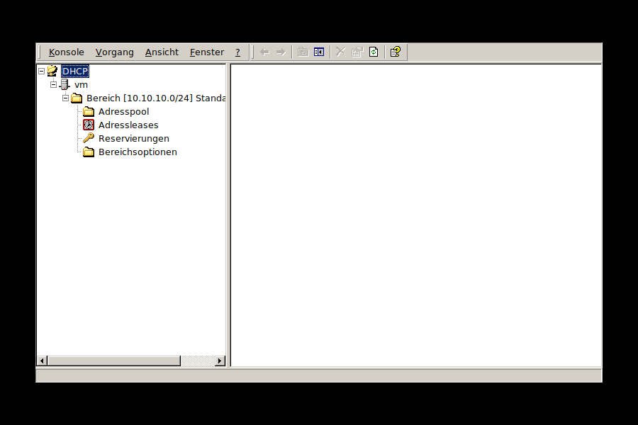

# dhcpmgr -- DHCP-Manager für ice2k

Ein Nachbau des Windows-2000-DHCP-Manager-Snapins (MMC) für
[ice2k](https://github.com/comdlg32/ice2k), gebaut mit demselben
FOX-Toolkit-Muster wie `dnsmgr` in diesem Repo. Backend: **Kea DHCPv4**
(nicht das veraltete isc-dhcp-server), Konfiguration über **Boost.JSON**.



## Funktionsumfang
- Fenster/Menü/Toolbar im MMC-Look, mit denselben Original-Icons wie `dnsmgr`
- Baumansicht wie im Original: DHCP -> Hostname -> Bereich -> **Adresspool**
  / **Adressleases** / **Reservierungen** / **Bereichsoptionen**
- Root-Rechte beim Start über `i2ksudo` (identisches Muster wie `dnsmgr`)
- Legt automatisch einen Demo-Bereich (`10.10.10.0/24`, Pool
  `.100`-`.200`, Router- und DNS-Server-Option) an, falls
  `/etc/kea/kea-dhcp4.conf` fehlt oder keinen Bereich enthält
- **Neuer Bereich...** (Assistent): Bereichsname, Beschreibung,
  Start-/End-IP-Adresse, Subnetzmaske -- Netz-CIDR wird automatisch
  berechnet
- **Neue Reservierung...**: legt sofort an und bleibt für weitere
  offen ("Hinzufügen"/"Schließen"), wie im Original
- **Bereichsoptionen konfigurieren...**: Router (003), DNS-Server (006),
  Domänenname (015), Verbindungsdauer (051)
- **Eigenschaften**/**Löschen** je Bereich, **Aktualisieren** überall
- Liest aktive Leases aus `/var/lib/kea/kea-leases4.csv` (reine Anzeige)
- Nach jedem Speichern wird `systemctl restart kea-dhcp4-server`
  automatisch ausgeführt; schlägt der Neustart fehl, erscheint eine
  Warnung in der Statuszeile statt es stillschweigend zu verschlucken

Jede geschriebene Konfiguration wird mit `kea-dhcp4 -t` gegen den
echten Kea-Parser validiert getestet, nicht nur auf gültiges JSON.

## Bauen
```sh
cd dhcpmgr
make
./dhcpmgr
```
Voraussetzung: `kea-dhcp4-server` und `libboost-json-dev` (+ das
Boost-Header-Metapaket `libboost1.83-dev`) installiert.

## Bekannte Grenzen / mögliche nächste Schritte
- Kein "Neuer Ausschlussbereich..." (Exclusion Range) -- Kea kennt das
  Konzept nicht direkt, müsste über mehrere Pool-Bereiche um die
  Lücke herum nachgebildet werden.
- Kein Aktivieren/Deaktivieren eines Bereichs.
- Bereichsoptionen sind auf Router/DNS-Server/Domänenname/
  Verbindungsdauer beschränkt (kein "Andere Optionen konfigurieren").
- Kein Steuerkanal/Control-Agent-Reload -- Änderungen wirken erst nach
  einem vollen `systemctl restart kea-dhcp4-server` (wird automatisch
  ausgeführt, siehe oben).
- Adressleases sind reine Anzeige, kein manuelles Löschen/Freigeben
  einzelner Leases.
- Kein Server-Eigenschaften-Dialog (globale Optionen).
