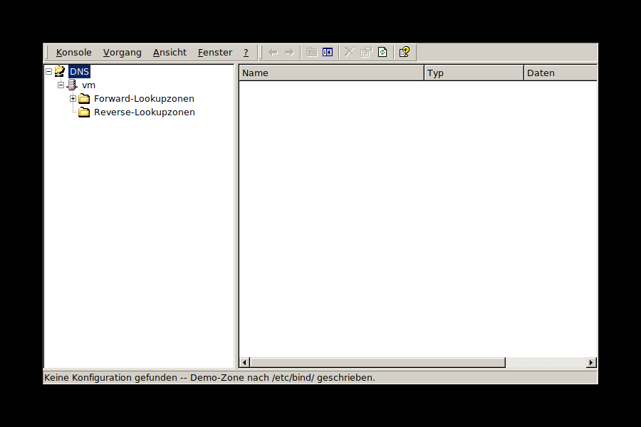

# dnsmgr -- DNS-Manager für ice2k

Ein Nachbau des Windows-2000-DNS-Manager-Snapins (MMC) für
[ice2k](https://github.com/comdlg32/ice2k), gebaut mit demselben
FOX-Toolkit-Muster wie `mmc/devmgmt` im ice2k-Repo.



## Funktionsumfang
- Fenster/Menü/Toolbar im MMC-Look, mit Original-Icons aus `mmc/devmgmt`
- Baumansicht: DNS -> Hostname -> Forward-/Reverse-Lookupzonen -> Zonen
- Record-Typ-Bezeichnungen exakt wie im Original ("Autoritätsursprung",
  "Namenserver", "Host", "Alias", "Mailaustausch", "Zeiger" -- ohne
  technische Abkürzungen in Klammern)
- Liest echte BIND9-Zonen aus `/etc/bind/named.conf.local` + Zonendateien
  (SOA, NS, A, CNAME, MX, PTR)
- Root-Rechte beim Start über `i2ksudo` (GUI-Passwortabfrage im
  Win2k-Look, wie bei `sysdm`/`timedate` im ice2k-Repo). Dank
  sudo-Timestamp-Caching i. d. R. nur einmal pro Sitzung nötig.
- Legt automatisch eine Demo-Zone `zwiebelchen.org` unter `/etc/bind/`
  an, falls `named.conf.local` fehlt oder keine Zone enthält
- **Zonen-Assistent** ("Neue Zone..."): Auswahl Forward-/
  Reverse-Lookupzone mit Live-Vorschau des berechneten
  `in-addr.arpa`-Namens, Button "Fertig stellen" wie im Original
- **Neuer-Host-, Neuer-Alias- (CNAME), Neuer-Mailserver- (MX) und
  Neuer-Zeiger-Dialog (PTR)**: legen Einträge per "... hinzufügen"
  sofort an und bleiben für weitere offen (mit Erfolgsmeldung,
  Felder-Reset), "Fertig stellen" schließt sie -- genauso wie im
  Original-Assistenten. Beim PTR-Dialog wird das Netzwerk-Präfix aus
  dem Zonennamen berechnet und vorangestellt, es muss nur noch das
  letzte Oktett eingegeben werden.
- **"Andere neue Datensätze..."**: Typauswahl-Dialog für Namenserver
  (NS), Text (TXT), Dienst (SRV) und IPv6-Host (AAAA), danach klassisches
  OK/Abbrechen (wie im Original -- nur der Host-Assistent legt mehrere
  nacheinander an)
- Kontextmenüs wie im Original:
  - Rechtsklick auf "Forward-/Reverse-Lookupzonen" -> **Neue Zone...** /
    **Aktualisieren**
  - Rechtsklick auf eine Forward-Zone -> **Neuer Host (A)...** / **Neuer
    Alias (CNAME)...** / **Neuer Mailserver (MX)...** / **Andere neue
    Datensätze...** / **Aktualisieren** / **Eigenschaften** / **Löschen**
  - Rechtsklick auf eine Reverse-Zone -> **Neuer Zeiger (PTR)...** /
    **Andere neue Datensätze...** / **Aktualisieren** / **Eigenschaften**
    / **Löschen**
  - Rechtsklick auf einen Eintrag in der Listenansicht -> **Eigenschaften**
    (alle Typen außer SOA) / **Löschen**
- **Eigenschaften-Dialoge** für alle Record-Typen außer SOA (auch für
  Mehrfeld-Typen wie MX und SRV, mit automatischem Auftrennen/
  Zusammensetzen der Anzeigewerte)
- **Zonen-Eigenschaften**: zeigen Zonenname/-typ/-datei und die rohen
  SOA-Werte (Serial/Refresh/Retry/Expire/Minimum); bei Reverse-Zonen
  zusätzlich die berechnete Netzwerk-ID (z.B. `10.10.10.0/24`)
- Toolbar "Löschen"/"Eigenschaften" wirken auf den markierten Eintrag
- Doppelklick auf einen Host-(A)-Eintrag öffnet den Eigenschaften-Dialog;
  IP-Änderungen werden in die Zonendatei geschrieben, `rndc reload`

Alle privilegierten Schreib-/Löschaktionen laufen über `i2ksudo`
(`runAsRoot()`/`writeFileAsRoot()` in `dnsmgr.cpp`) -- es läuft nie die
komplette GUI als root, nur die einzelnen Dateizugriffe.


## Active Directory-integrierte Zonen

Auf einem Domänencontroller liegt die AD-Zone nicht in einer Zonendatei,
sondern in der Samba-Datenbank -- im Windows-2000-kompatiblen Modus
bedient sie Sambas eigener DNS-Server, im modernen Modus BIND über DLZ.
dnsmgr zeigt diese Zonen deshalb zusätzlich zu den Dateizonen aus
`named.conf.local` an und verwaltet sie über `samba-tool dns` (als root
mit dem Maschinenkonto, `-P`, ohne Kennwortabfrage):

- Anzeige aller Einträge samt SOA, Namenserver, Hosts, Mailaustausch,
  Diensten. Unterdomänen wie `_tcp`, `_sites`, `DomainDnsZones` stehen
  wie im Original als Ordner im Baum (jede Ebene wird erst beim Öffnen
  geladen); ein Doppelklick auf eine Unterdomäne in der Liste öffnet sie.
- Hosts, Aliasse, Mailaustausch, Zeiger und die übrigen Typen anlegen
  -- dieselben Dialoge wie bei Dateizonen; ein PTR-Eintrag landet auf
  Wunsch in einer passenden AD-Reverse-Zone.
- Einträge aller Typen bearbeiten (`samba-tool dns update` tauscht alten
  und neuen Wert in einem Schritt) und löschen. Neue Einträge landen in
  der gerade gewählten Unterdomäne.
- Neue Zonen legt dnsmgr auf einem Domänencontroller als AD-integrierte
  Zone an (`zonecreate`), wie im Original. Die Domänenzone und
  `_msdcs.<Domäne>` lassen sich nicht löschen.
- Zoneneigenschaften zeigen "Active Directory-integriert" und die
  SOA-Werte aus der Datenbank.

**Dienstprüfung passend zum Modus:** Im Windows-2000-kompatiblen Modus
beantwortet Sambas eigener DNS-Server die AD-Zonen; geprüft wird dann
`samba-ad-dc` (bzw. der laufende `samba`-Prozess), und ein gestopptes
BIND erscheint nur als Hinweis in der Statuszeile, weil es lediglich die
Dateizonen und die Weiterleitung betrifft. Im modernen Modus (DLZ) und
ohne Domänencontroller bleibt BIND der maßgebliche Dienst.

**Wichtig:** Früher schrieb dnsmgr eine Beispielzone nach
`/etc/bind/named.conf.local`, wenn die Datei kein `zone` enthielt -- auf
einem Domänencontroller im modernen Modus hätte das die DLZ-Einbindung
von Samba überschrieben. Heute wird die Beispielzone nur noch angelegt,
wenn die Datei gar nicht existiert und kein Domänencontroller vorhanden
ist; Beispieldaten im Speicher sind im Baum als "(Beispieldaten)"
gekennzeichnet.

## Bauen
Voraussetzung: ein ice2k-Debian-13-System (stellt `fox-config`, `reswrap`
und `i2ksudo` bereit, siehe [ice2k](https://github.com/comdlg32/ice2k)).

```sh
make
./dnsmgr
```

## Bekannte Grenzen / mögliche nächste Schritte
- "Liste exportieren..." (Export der Zone/Ansicht) ist noch offen -- geplant.
- "Neue Zone"/"Zone löschen" rufen `rndc reconfig` auf -- bei BIND9 mit
  AppArmor muss der Zonendatei-Ordner im `named`-Profil freigegeben sein.
- PTR-Erstellung beim Anlegen eines Hosts (Checkbox im Host-Dialog) ist
  weiterhin best-effort: nur klassische `/24`-Reverse-Zonen
  (`c.b.a.in-addr.arpa`) werden automatisch erkannt; beim Löschen eines
  Hosts wird der zugehörige PTR-Eintrag noch nicht automatisch
  mitgelöscht. Manuelles Anlegen über "Neuer Zeiger (PTR)..." funktioniert
  unabhängig davon immer.
- CNAME/MX-Zielhosts werden beim Speichern nicht auf Gültigkeit
  geprüft (keine FQDN-Validierung).
- Zonen-Eigenschaften sind nur eine Anzeige (SOA-Werte lassen sich noch
  nicht direkt darin bearbeiten).
- Kein Undo für Löschaktionen.
- Bearbeiten/Löschen findet bei mehreren Records mit identischem
  Name+Typ (z.B. zwei NS-Einträge für "@") immer nur den ersten
  Treffer -- für Round-Robin-Konfigurationen mit Bedacht nutzen.
