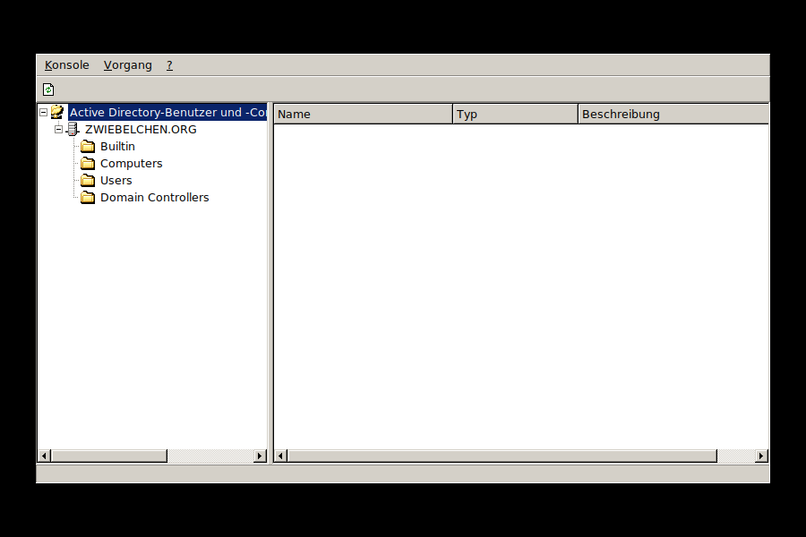

# dsadmin -- Active Directory-Benutzer und -Computer für ice2k

Ein Nachbau des echten `dsa.msc`-Snapins für
[ice2k](https://github.com/comdlg32/ice2k). Backend: **Samba-AD-
Domäne via `samba-tool`** (`user`/`group`/`ou`/`computer`/`gpo`).



## Einordnung im Projekt

Sobald ein Server per `dcpromo` zum Domänencontroller wird, verwaltet
`compmgmt` ("Lokale Benutzer und Gruppen") keine echten Konten mehr --
genau wie im Original wandern Benutzer/Gruppen in die
Domänendatenbank. `dsadmin` übernimmt genau das: die Verwaltung von
**Domänenkonten** statt lokaler Konten.

## Funktionsumfang
- Baumstruktur: Domäne -> Builtin/Computers/Users/Domain Controllers
  + eigene Organisationseinheiten, beliebig tief verschachtelt (ein
  einziger `samba-tool ou list`-Aufruf für den ganzen Baum, die OUs
  werden nach Tiefe sortiert eingehängt)
- Container-Anzeige mit Typ-Klassifizierung (Benutzer/Sicherheits-
  gruppe/Computer/Organisationseinheit/Container) und passenden Icons
- **Neu**: Benutzer/Gruppe/Organisationseinheit anlegen
- **Löschen** für Benutzer/Gruppe/Organisationseinheit
- **Umbenennen...** -- bei Benutzern/Gruppen über `samba-tool ...
  rename --force-new-cn`, ändert also nur den Anzeigenamen (CN) und
  lässt den Anmeldenamen unberührt, genau wie das einfache
  F2-Umbenennen im echten Active Directory; bei
  Organisationseinheiten über `samba-tool ou rename`
- **Verschieben...** zwischen Containern/Organisationseinheiten
  (`samba-tool <user|group|ou> move`), mit Zielauswahl über eine Liste
  aller OUs -- die Domänenwurzel selbst ist ebenfalls als Ziel wählbar
- **Sicherheitseinstellungen**: domänenweite Kennwort- und
  Kontosperrungsrichtlinie (`samba-tool domain passwordsettings`) --
  Komplexität, Mindestlänge, Kennwortchronik, Mindest-/Höchstalter,
  Sperrschwelle, Sperrdauer und Zurücksetzungsfenster. In AD gibt es
  davon (vor den granularen Richtlinien von 2008) nur genau eine
- **Eigenschaften** mit dem **"Gruppenrichtlinie"**-Reiter (GPOs
  anlegen/verknüpfen/lösen über `samba-tool gpo`) und dem
  vollständigen Gruppenrichtlinienobjekt-Editor dahinter (siehe unten)

## Gruppenrichtlinienobjekt-Editor

Der "&Bearbeiten..."-Button im Gruppenrichtlinie-Reiter öffnet den
vollständigen Editor: Baum links (Kategorien aus den zusammengeführten
`.adm`-Dateien), Liste rechts (Richtlinien mit Status). Doppelklick
öffnet Nicht konfiguriert/Aktiviert/Deaktiviert plus das passende
Eingabefeld (Checkbox/Textfeld/Zahlenfeld/Dropdown). "Speichern"
schreibt die Änderungen in die echte `Registry.pol` des GPOs unter
`/var/lib/samba/sysvol/<Domäne>/Policies/{GUID}/MACHINE/Registry.pol`
und erhöht die `GPT.INI`-Versionsnummer.

Ende-zu-Ende gegen eine echte Domäne und ein echtes GPO getestet --
alle Feldtypen (Checkbox/Text/Zahl/Dropdown), byte-genaue Verifikation
des Dateiinhalts, Rundlauf über einen kompletten Programmneustart.

Unterstützt sowohl Computer- als auch Benutzerkonfiguration (`CLASS
MACHINE`/`CLASS USER`, jeweils eigener Baum-Wurzelknoten und eigene
`Registry.pol` im SYSVOL) sowie Richtlinien mit mehreren Parts (jeder
Part bekommt sein eigenes Eingabefeld und seinen eigenen
Registry.pol-Eintrag). `GPT.INI` kodiert Computer-/Benutzer-Version
getrennt und wird beim Speichern gezielt nur für den tatsächlich
geänderten Zweig erhöht.

Mehrere Richtlinien lassen sich gemeinsam markieren (Strg/Umschalt) und
über die Schaltflächen unter der Liste auf einen Schlag auf
"Aktiviert"/"Deaktiviert"/"Nicht konfiguriert" setzen. Ausgenommen ist
"Aktiviert" bei Richtlinien mit Eingabefeldern -- deren Werte kann eine
Sammelaktion nicht erraten, sie werden übersprungen und gemeldet, damit
man sie einzeln per Doppelklick setzt.

## Weitere Gruppenrichtlinien-Erweiterungen

Neben den Administrativen Vorlagen sind drei weitere
Client Side Extensions umgesetzt. Alle drei tragen sich bei Bedarf
selbst in `gPCMachineExtensionNames`/`gPCUserExtensionNames` des GPOs
ein -- ohne diesen Eintrag würde ein echter Client die Erweiterung nie
aufrufen, selbst wenn die Einstellungen vorhanden sind.

- **Softwareinstallation** (nach [MS-GPSI]): legt unterhalb des
  skopierten GPO-Zweigs `CN=Class Store` und darunter `CN=Packages` an,
  **beide als `classStore`**. Das ist vom Schema vorgegeben: unterhalb
  eines `classStore` sind laut `possSuperiors` nur
  `packageRegistration`, `typeLibrary`, `classRegistration`,
  `categoryRegistration` und `classStore` erlaubt -- ein gewöhnlicher
  `container` wird mit "Naming violation (64)" abgelehnt. "Durchsuchen..." startet im
  zuletzt benutzten Verzeichnis (sonst `/srv/freigaben`) und schlägt
  nach der Auswahl den UNC-Pfad vor -- dazu wird in der `smb.conf` die
  Freigabe gesucht, unter der die Datei liegt (bei verschachtelten
  Freigaben gewinnt die längste Übereinstimmung). legt ein
  `packageRegistration`-Objekt per LDAP in AD an und schreibt die
  zugehörige `.aas`-Datei ins SYSVOL. Die nötigen Objektklassen sind
  Teil des Standard-AD-Schemas und bei Samba bereits vorhanden.
- **Skripte** (nach [MS-GPSCR]): An-/Abmeldung für die Benutzer-,
  Start/Herunterfahren für die Computerkonfiguration, je eine
  `scripts.ini` pro Zweig (UTF-16LE mit BOM, durchnummerierte
  `CmdLine`/`Parameters`-Paare).
- **Ordnerumleitung** (nach [MS-GPFR], "Version Zero" -- die einzige
  Version, die Windows 2000 beherrscht): Eigene Dateien, Eigene
  Bilder, Startmenü, Anwendungsdaten und Desktop. Der Zielpfad selbst
  läuft ganz normal über die `User Shell Folders`-Werte in der
  `Registry.pol`; zusätzlich wird eine `fdeploy.ini` geschrieben,
  bewusst nur mit dem sichersten Standard-Flag (0), da die genaue
  Bit-Bedeutung öffentlich nicht vollständig dokumentiert ist.

## Kodierung der ADM-Dateien

ADM-Vorlagen liefert Microsoft sowohl in ANSI als auch in UTF-16 aus.
Der Parser erkennt die Kodierung selbst -- über die
Bytereihenfolge-Markierung, ersatzweise über die Verteilung der
Nullbytes -- und wandelt vor dem Zerlegen nach UTF-8.

Ohne das verschwindet eine UTF-16-kodierte Datei stillschweigend: hinter
jedem Zeichen steht ein Nullbyte, der Tokenizer findet kein einziges
`CATEGORY` und der Editor zeigt einen leeren Baum. In der Praxis fehlte
dadurch die gesamte `system.adm` (Desktop, Startmenü, Systemsteuerung,
System, Netzwerk, Drucker), während die ANSI-kodierte `inetres.adm`
daneben sauber durchlief -- also genau die Art Fehler, die aussieht wie
"da fehlt noch was" statt wie ein Fehler.

## Versionszähler

Jede Änderung an einem GPO erhöht dessen Versionszähler, und zwar an
beiden Stellen: im AD-Attribut `versionNumber` und in der `GPT.INI` im
SYSVOL, die denselben Wert bekommt. Das obere Halbwort zählt die
Benutzer-, das untere die Computerkonfiguration.

Das ist nicht optional: ein Client merkt sich pro GPO die zuletzt
verarbeitete Version und überspringt es beim nächsten Start
vollständig, wenn sie unverändert ist. Wurde ein GPO also einmal leer
verarbeitet und danach ein Paket hinzugefügt, ohne die Nummer zu
erhöhen, passiert nie wieder etwas -- egal wie oft neu gestartet wird.
Genau das ist in der Praxis aufgetreten: der Zähler wurde nur beim
Speichern im Editor der administrativen Vorlagen erhöht, nicht bei
Softwareinstallation, Skripten oder Ordnerumleitung, und das
AD-Attribut gar nicht.

Schlägt das Schreiben in AD fehl, bleibt die `GPT.INI` absichtlich
unverändert, damit beide Stellen zusammenpassen.

LDAP-Schreibzugriffe laufen über `ldapadd`/`ldapmodify` gegen den
lokalen Samba-DC und brauchen -- wie GPOs selbst -- echte
Administrator-Anmeldedaten; root allein genügt dafür nicht.

Diese Werkzeuge stecken im Paket `ldap-utils`, das auf einem frischen
Debian fehlt. `dsadmin` prüft vor dem ersten LDAP-Zugriff, ob sie
vorhanden sind, und bietet die Installation an -- sonst scheitert die
erste GPO-Änderung mit einer nichtssagenden `env`-Meldung. `dcpromo`
installiert das Paket inzwischen gleich bei der Heraufstufung mit.

## Verknüpfungsreihenfolge

Die Schaltflächen "Nach oben"/"Nach unten" im Gruppenrichtlinie-Reiter
verschieben eine Verknüpfung innerhalb der Liste. `samba-tool` kennt
dafür keinen Befehl (`gpo setlink` hängt nur an, `gpo dellink`
entfernt), deshalb wird das `gPLink`-Attribut des Containers direkt per
LDAP gelesen, umsortiert und komplett zurückgeschrieben. Die
Optionsflags jeder einzelnen Verknüpfung (`;0`, `;1` ...) bleiben dabei
erhalten.

Offener Punkt: Die Liste zeigt die Verknüpfungen in genau der
Reihenfolge, in der sie im `gPLink`-Attribut stehen (das ist auch die
Ausgabereihenfolge von `samba-tool gpo getlink`). Welches Ende davon
die höhere Priorität hat, ist hier noch nicht gegen einen echten
Client verifiziert -- im echten Active Directory hängt `setlink` neue
Verknüpfungen hinten an, während sie in der Oberfläche oben mit der
höchsten Priorität erscheinen. Sollte sich das bestätigen, müsste die
Anzeige umgedreht werden, damit "Nach oben" wie im Original
"höhere Priorität" bedeutet.

## Gruppenmitgliedschaft

"Eigenschaften" auf einer Sicherheitsgruppe öffnet eine
Mitgliederliste mit Hinzufügen/Entfernen (`samba-tool group
addmembers`/`removemembers`/`listmembers`) -- für besonders
geschützte Gruppen greift bei Bedarf derselbe Administrator-
Anmeldedaten-Fallback wie bei GPOs.

## Anzeigename vs. Anmeldename

Der Anzeigename eines Objekts (CN, z.B. "Max Mustermann") und sein
Anmeldename (sAMAccountName, z.B. "mmustermann") können sich
unterscheiden. `dsadmin` führt beide getrennt (`accountName`-Feld) --
ermittelt über einen `samba-tool ... list --full-dn`-Abgleich statt
über einen reinen Namensvergleich, der bei abweichenden CNs sonst
fehlschlagen würde.

## GPOs brauchen echte Administrator-Anmeldedaten

`CN=Policies,CN=System` ist besonders geschützt: Weder root noch das
Maschinenkonto des Domänencontrollers dürfen dort schreiben --
genau wie im echten AD dürfen nur Domain Admins GPOs anlegen. Beim
ersten GPO-Schreibzugriff (Neu/Hinzufügen/Entfernen) fragt `dsadmin`
deshalb einmalig nach Administrator-Anmeldedaten und cacht sie für
die laufende Sitzung. **Lesen** (GPO-Liste, Verknüpfungen anzeigen)
funktioniert dagegen problemlos ohne das.

## Bauen
```sh
cd dsadmin
make
./dsadmin
```

## Bekannte Grenzen
- Objekte werden immer in dem Container angelegt, der im Baum markiert
  ist -- auch beim Rechtsklick auf einen anderen Knoten wird dieser
  zuerst zum aktuellen Container gemacht. (FOX löst bei
  `setCurrentItem()` kein `SEL_CHANGED` aus; ohne das ausdrückliche
  Nachziehen landeten Benutzer, Gruppen und Computer still im zuvor
  angeklickten Container.)
- Organisationseinheiten unterhalb eines ausgeblendeten Containers
  erscheinen nicht im Baum; die DN-Zerlegung trennt an Kommas und
  behandelt maskierte Kommas in einem RDN nicht.
- Umsortieren der Verknüpfungen und die Sammeländerung im Editor sind
  bisher nur kompiliert und mit Einzeltests der Zerlegungs-/
  Sortierlogik geprüft, noch nicht gegen eine laufende Domäne.
- Bekannte, ungelöste Einschränkung aus dem Testen: Das Eingabefeld
  für einen neuen GPO-Namen (aus dem bereits modalen Eigenschaften-
  Dialog heraus geöffnet) nahm in der Xvfb-Testumgebung ohne
  Fenstermanager keinen Tastaturfokus an -- noch nicht auf einem
  echten System mit Fenstermanager verifiziert.
